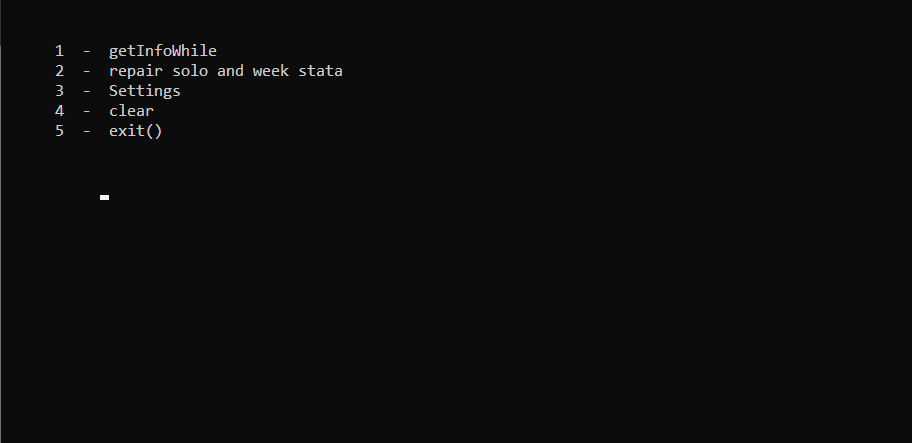
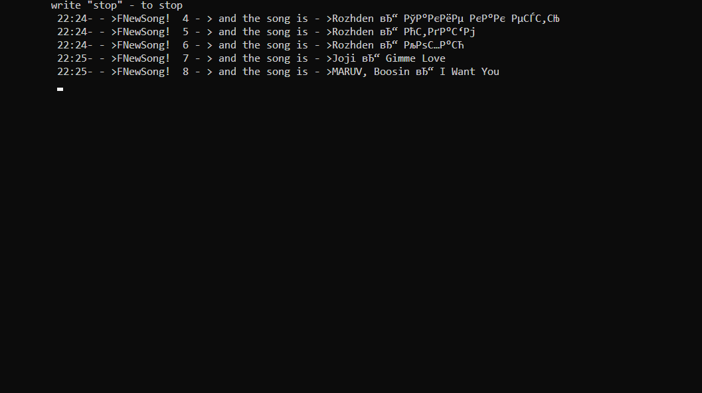
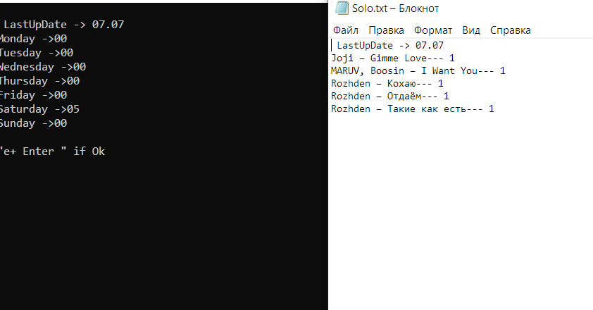
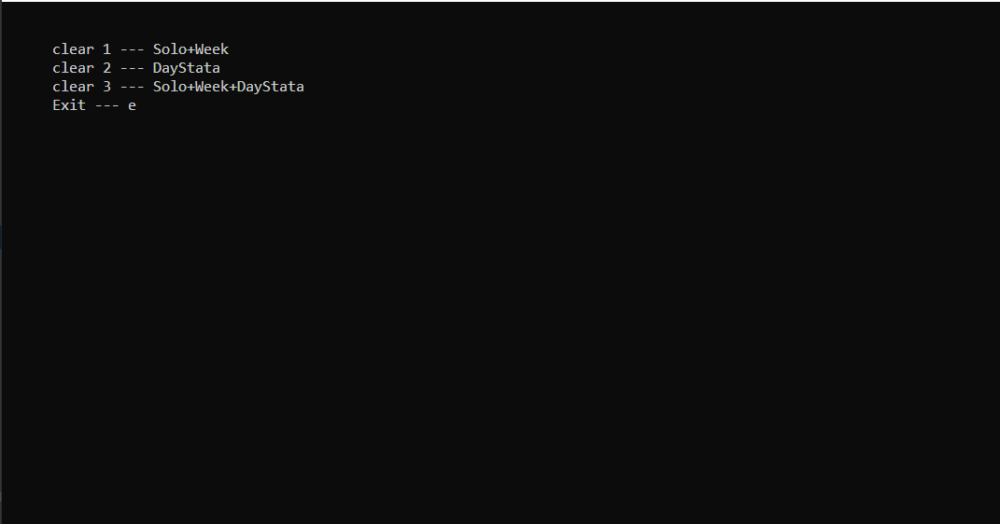

# vk_music_listener

## Запуск

Следует в файле App/PythonApplication1.py  заменить строчку с тоекном на токен из сайта https://vkhost.github.io/
(нажать на любой сервир, нажать получить ключ, и из web строки скопировать этот ключ) 

Далее запустить App/App.exe

Приложение работает при условии, что на компьютере установлен питон. ( Чтобы проверить -> сmd : >> python   . Должно кинуть в питоновский shell.) 

Если всё равно не запускается, пишем  pip install requests, vk в главном python и ещё раз пытаемся.

______ 

## Фото работы 

____

## Мини-инструкция 

Приложение всего лишь парсит текущую музыку в статусе, поэтому если музыка в статусе не указана, то оно ничего и не найдёт. Ваш ключ необходим для того, чтобы пользователи с скрытым аккаунтом, но открытым для вас, были так же прослушиваемы.

*  getInfoWhile -> Запускает цикл, выписывает названия найденных песен в консоль, есть проблемы с кирилицей.
*  repair solo and week stata -> Открывает файл с музыкой за сегодня и выдаёт статистику за неделю по кол-ву песен
*  Settings -> позволяет выставлять id прослышиваемого человека
*  clear -> очищает все данные 
*  exit() -> даже не знаю, что оно может делать

___

# Написал её для себя, чтобы следить за подругой :) 
